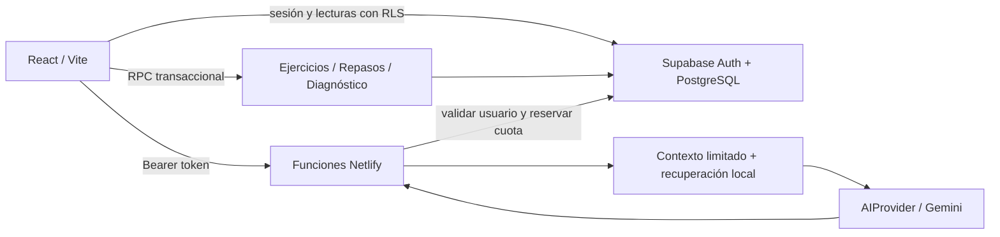

# Arquitectura

## Responsabilidades

React representa contenido y recoge respuestas. El backend valida identidad con `auth.getUser`, no con datos de usuario enviados por el navegador. Las claves privadas nunca se incorporan al build.

PostgreSQL conserva progreso, respuestas, repasos, diagnóstico, intereses, errores y uso de IA. Los RPC bloquean la fila, comprueban una versión y escriben atómicamente. Dos dispositivos no pueden enviar exitosamente el mismo paso con la misma versión.

Los datos educativos originales viven en `src/data` y se importan al catálogo de PostgreSQL con un seed reproducible. El catálogo local permite exploración previa a la conexión. Una actividad local no se disfraza de avance remoto.

La recuperación para el tutor es léxica y limitada a dos lecciones, o una lección explícita. No se necesitan embeddings para 28 documentos cortos. `AIProvider` separa la orquestación del proveedor. Solo Gemini está implementado; otras capacidades y proveedores deben añadirse con pruebas antes de anunciarlos.

## Diagnóstico y concurrencia

El reloj se calcula en el servidor. Cada 15 segundos el cliente renueva una concesión activa; se cuentan como máximo 45 segundos desde el último contacto para no cobrar indefinidamente tiempo de una pestaña abandonada. Al pausar se cierra el tramo activo. Cerrar abruptamente puede consumir hasta 45 segundos adicionales hasta la siguiente interacción; el total nunca supera 900. Una versión obsoleta pausa la interfaz y requiere recarga.

Este límite acota uso y duración, no hace del diagnóstico un examen supervisado. Las muestras son pequeñas y las calificaciones son orientativas.

## Despliegue y evolución

Netlify sirve archivos estáticos y funciones. Supabase ofrece PostgreSQL y autenticación. La migración SQL, el catálogo, la lógica educativa y los adaptadores son exportables. Migrar Auth requiere un plan específico para sesiones y usuarios; no se promete portabilidad instantánea.

Sin IA, permanecen el contenido, correcciones cerradas, guardado y SRS. Sin base de datos se puede explorar, pero no hay sincronización. El modo offline persistente no forma parte del alcance actual.
