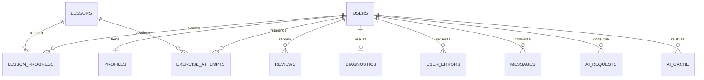

# Base de datos

Migración: `supabase/migrations/001_initial.sql`. Cada cuenta usa `auth.users.id`; eliminarla hace cascada sobre sus datos personales.

- `pilot_invites`: correos permitidos para el registro; sin acceso desde el navegador.
- `profiles`: nombre, nivel declarado/estimado, interés, tiempo diario y onboarding.
- `lessons`: identificador estable, nivel, habilidad y contenido estructurado JSON. `active=false` retira una lección de las lecturas autorizadas.
- `lesson_progress`: paso, estado, aciertos, respuestas evaluables y versión. Clave compuesta usuario/lección.
- `exercise_attempts`: evidencia de respuesta y corrección cerrada. `correct=null` significa que no hubo evaluación determinista; no cuenta como acierto.
- `user_errors`: respuesta, corrección y explicación para reforzar errores. Nunca se suman aciertos por respuestas abiertas sin evaluar.
- `reviews`: frente/reverso y estado SM-2. Índice usuario/fecha para recuperar los próximos repasos.
- `diagnostics`: respuestas estructuradas, segundos activos, versión y finalización. Una evaluación por cuenta en esta versión.
- `messages`: conversación textual persistente. Índice usuario/id permite recuperar solo mensajes recientes.
- `feedback`: reportes de contenido que el propietario consulta con permisos de administración.
- `ai_requests`: reservas de cuota, operación, estado, tokens reales, latencia y costo estimado opcional. Índice de fecha/usuario.
- `ai_cache`: explicaciones reutilizables aisladas por usuario, con vencimiento y borrado en cascada.

## Escrituras y seguridad

`submit_exercise` verifica usuario, lección activa, versión, respuesta y paso. Guarda intento, error y avance; al terminar incorpora vocabulario a los repasos sin duplicarlo. `rate_review` programa la siguiente fecha y rechaza una versión ya consumida. `save_diagnostic` guarda bajo bloqueo y acota el reloj a 900 segundos.

Las tablas personales tienen RLS. Los usuarios solo leen sus filas. No hay escritura directa sobre resultados, repasos, mensajes o auditoría. Las columnas de perfil permitidas se actualizan con RLS. Solo las funciones del servidor usan la clave de servicio y deben mantener filtros explícitos por usuario.

`reserve_ai` es exclusivo del rol de servicio y serializa las reservas con un bloqueo transaccional global; cuenta también intentos fallidos para evitar reintentos ilimitados. Los días se delimitan por el reloj del servidor.

## Operación

El seed es idempotente por ID; volver a ejecutarlo reemplaza el contenido de las lecciones iniciales, por lo que debe revisarse antes de usarlo después de una edición manual. Para cambiar una lección ya contestada sin invalidar pasos, publica un ID nuevo o implementa versionado editorial.

La migración es inicial y no se debe repetir sobre una base ya creada. Los cambios posteriores deben ser migraciones incrementales. El plan gratuito no se trata como sustituto de una estrategia de respaldos; el propietario debe preparar exportaciones y comprobar restauración antes de uso sostenido.
